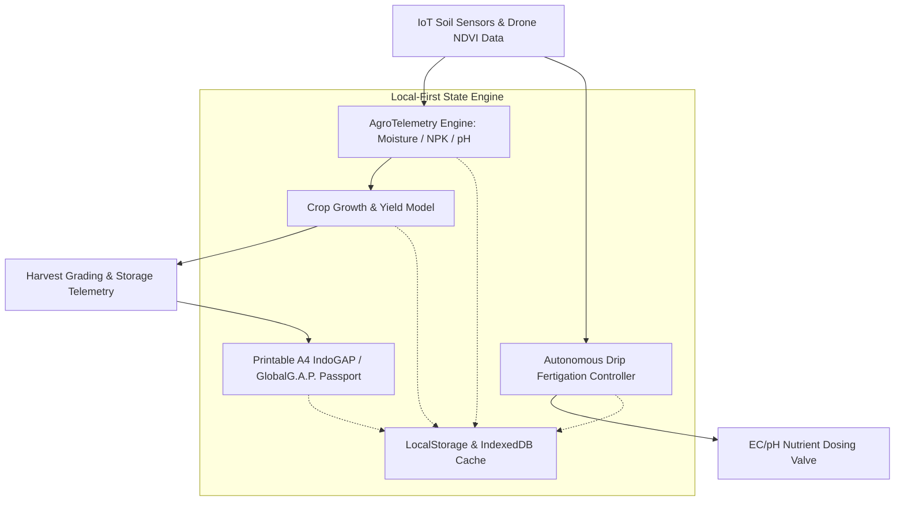

# 🌾 AgroHarvest OS — Smart Precision Agriculture & Autonomous Fertigation OS

<p align="center">
  
  
  
  
  
  
  
  
</p>

> 🚀 **Live Production Application:** [https://olyxmintabansos-byte.github.io/agroharvest-os/](https://olyxmintabansos-byte.github.io/agroharvest-os/)

---

### 🌐 System Overview & Vision

**AgroHarvest OS (Titan #31)** adalah sistem operasi pertanian presisi pintar (*Smart Precision Agriculture & IoT Agro-Logistics OS*) terpadu untuk perkebunan modern, *smart greenhouse*, dan sentra agribisnis komersial yang beroperasi sesuai pedoman sertifikasi **IndoGAP (Indonesian Good Agriculture Practice)** dan **GlobalG.A.P.**.

Dibangun dengan arsitektur **Client-Side Local-First**, AgroHarvest OS mengolah data telemetri sensor tanah per petak (*soil moisture, NPK, suhu, pH*), indeks vegetasi citra satelit/drone multispektral (*NDVI Index*), automasi fertigasi tetes presisi, estimasi tonase hasil panen, serta penerbitan sertifikat asal panen format A4 resmi tanpa ketergantungan server runtime atau latensi jaringan.

---

### 🎨 Design System: #24 Organic Blob Shapes + #16 Pastel Soft Aesthetic

Antarmuka AgroHarvest OS mengedepankan atmosfer alami ramah lingkungan dengan kehangatan visual organik:
- **Organic Fluid Blob Accents**: Siluet melengkung asimetris (`rounded-[2.5rem]`, sudut organik cairan nutrisi) yang merefleksikan dinamika pertumbuhan tanaman.
- **Pastel Soft Botanical Palette**:
  - Hijau Daun Lembut (*Pastel Sage `#A3C9A8`*)
  - Kuning Jerami Hangat (*Warm Wheat `#F4E8C1`*)
  - Tanah Subur (*Muted Clay Earth `#D8B4A6`*)
  - Kanvas Herbal Segar (*Soft Mint Cream `#F7FAF7`*)
- **Tactile Sensor Cards**: Kartu metrik IoT dengan bayangan lembut bergradasi alami yang ramah di mata petani maupun agronom lapangan.

---

### 🌟 Key Functional Pillars

#### 1. 🌱 IoT Telemetri Sensor Tanah & Analisis NDVI (`/`)
- **Soil Sensor Grid**: Monitoring kadar air tanah (*Soil Moisture %*), tingkat keasaman (*pH*), temperatur perakaran (°C), dan konsentrasi hara esensial Nitrogen (N), Fosfor (P), dan Kalium (K) per petak lahan.
- **Multispectral NDVI Index**: Evaluasi indeks kesehatan kanopi tanaman (*Normalized Difference Vegetation Index*) untuk deteksi dini stres kekeringan atau defisiensi klorofil.
- **Irrigation Stress Alerts**: Peringatan instan saat kadar air tanah turun di bawah titik layu kritis (*critical wilting point*).

#### 2. 🧪 Sistem Fertigasi Tetes Otomatis (`/nutrisi`)
- **Precision Drip Fertigation**: Pengaturan otomatis laju injeksi pupuk cair berdasarkan Konduktivitas Elektrik (*Electrical Conductivity / EC mS/cm*) dan pH air siram.
- **Nutrient Recipe Formulation**: Penyesuaian rasio hara makro dan mikro sesuai fase fisiologis tanaman (vegetatif, generatif, pengisian buah).

#### 3. 🚜 Prediksi Panen & Grading Pasca Panen (`/panen`)
- **Yield Forecasting Algorithm**: Proyeksi tonase panen per hektar berdasarkan akumulasi pertumbuhan biomassa dan riwayat cuaca mikro.
- **Post-Harvest Cold Storage**: Monitoring suhu dan kelembaban ruang simpan dingin (*cold storage*) untuk memperpanjang umur simpan produk segar.

#### 4. 📜 IndoGAP & GlobalG.A.P. Certified Harvest A4 (`/sertifikasi`)
- **Traceable Agricultural Certificate**: Generator sertifikat asal-usul panen siap cetak format A4 resmi dengan barcode penelusuran lot, catatan residu pestisida nol, dan validasi sertifikasi agronomis berwenang.

---

### 🏗️ Architecture & Data Flow



---

### 📁 Directory Layout

```
agroharvest-os/
├── public/
│   └── .nojekyll                 # Jekyll bypass for GitHub Pages
├── src/
│   ├── app/
│   │   ├── nutrisi/page.tsx      # Drip fertigation & nutrient recipe dosing
│   │   ├── panen/page.tsx        # Harvest yield prediction & cold chain storage
│   │   ├── sertifikasi/page.tsx  # IndoGAP & GlobalG.A.P. A4 harvest report
│   │   ├── layout.tsx            # Global layout with Organic Blob Pastel styling
│   │   └── page.tsx              # Soil moisture, NPK sensors & NDVI farm overview
│   ├── components/
│   │   └── Navbar.tsx            # Botanical header & irrigation status monitor
│   ├── context/
│   │   └── AgroContext.tsx       # Reactive state machine for agricultural telemetry
│   └── types/
│       └── agro.ts               # Sensor, crop, fertigation & certification schema
├── next.config.ts                # Static export configuration
└── package.json                  # Dependencies & scripts
```

---

### 🛠️ Technology Stack

| Domain | Technology / Library | Rationale |
|---|---|---|
| **Framework** | Next.js 16.3 (App Router) | Static export optimized for low-bandwidth rural plantation setups |
| **Language** | TypeScript (Strict Mode) | Zero-defect fertigation dosing and soil biometric models |
| **Styling** | Tailwind CSS v4 | CSS-first zero-runtime utility styling with Organic Pastel curves |
| **Icons & UI** | Lucide React | Agricultural, botanical, sensor, and weather iconography |
| **Visual FX** | Canvas-Confetti | Interactive harvest celebration on batch certification |
| **Persistence** | Local-First Storage | Offline-first field data logging without satellite link dependence |
| **Deployment** | GitHub Pages (`gh-pages`) | Static hosting with `.nojekyll` bypass |

---

### 🚀 Getting Started & Local Development

Clone repositori dan jalankan pada local development environment:

```bash
# 1. Clone repository
git clone https://github.com/olyxmintabansos-byte/agroharvest-os.git
cd agroharvest-os

# 2. Install dependencies
npm install

# 3. Jalankan development server
npm run dev
```

Buka [http://localhost:3000](http://localhost:3000) pada browser Anda.

#### Build & Static Export

```bash
# Build static export ke direktori out/
npm run build

# Deploy langsung ke GitHub Pages branch gh-pages
npx --yes gh-pages -d out -b gh-pages --dotfiles
```

---

### 📄 License & Attribution

Didistribusikan di bawah lisensi MIT. Silakan gunakan untuk perkebunan presisi, smart greenhouse, koperasi tani, maupun penelitian agronomi.

<p align="center">
  
  
</p>

<p align="center">
  <strong>© 2026 by Olyx (@olyxmintabansos-byte)</strong> • All rights reserved.
</p>
